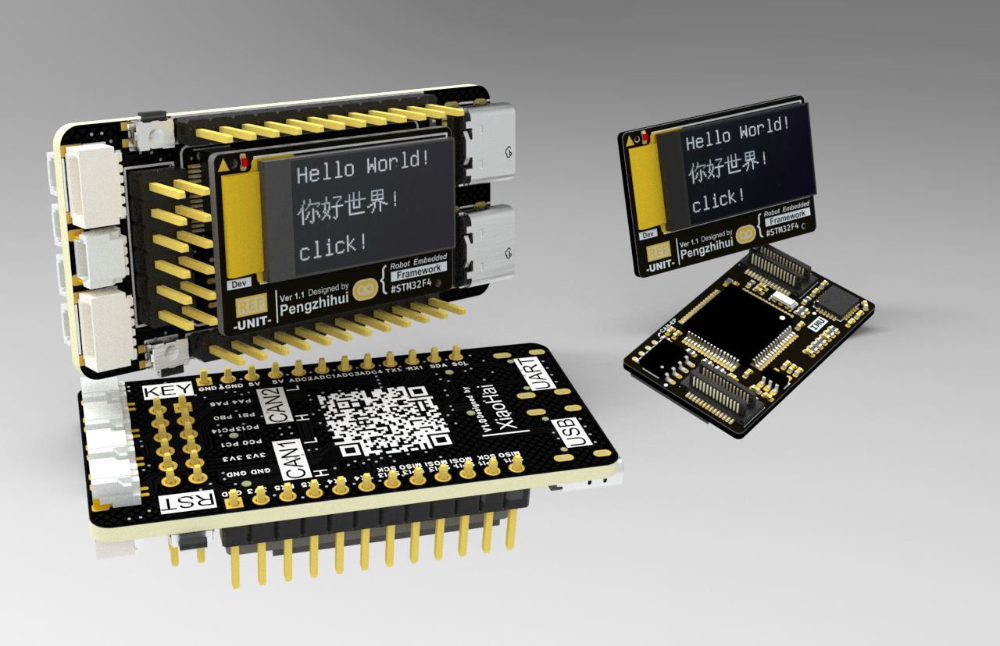

基于稚晖君的Dummy机械臂核心板REF_Uint设计的REF_Base电路板

- 目前开源仓库包括：

  1. Hardware：包括基于立创EDA专业板设计的电路板源工程文件和生产制造所需要的打板Gerber文件
  2. Firmware：例程代码、两块电路板的原理图
     - F405_Demo：基于定时器实现了LED灯的闪烁，按键的单击和长按，并通过串口打印
     - OLED_Demo：在F405_Demo的基础移植了U8G2库
     - OLED_RTOS_Demo：在OLED_Demo的基础上移植了FreeRTOS
     - OLED_AstraUI：在OLED_RTOS_Demo的基础上添加了按键单击、双击和长按，移植了B站开源的AstraUI
     - IMU_RTOS_Demo：在OLED_RTOS_Demo的基础上添加了MPU6050的相关代码，支持DMP解算以及高通、低通、斜率滤波
  3. Images：电路板的渲染图片

- 参考资料：

  稚晖君的REF_Unit电路板开源仓库：https://github.com/peng-zhihui/Dummy-Robot/tree/main/1.Hardware/REF

  AstraUi原作者视频：https://www.bilibili.com/video/BV1i4421D7nJ?spm_id_from=333.788.recommend_more_video.-1&vd_source=b2d2260f634ebe2d5f677833af8bf474

  AstraUi开源仓库：https://github.com/AstraThreshold/oled-ui-astra

  
